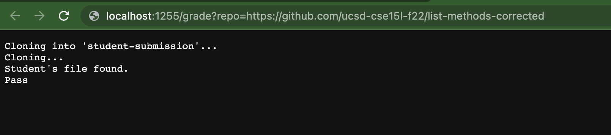
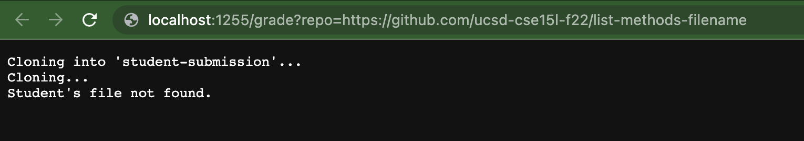
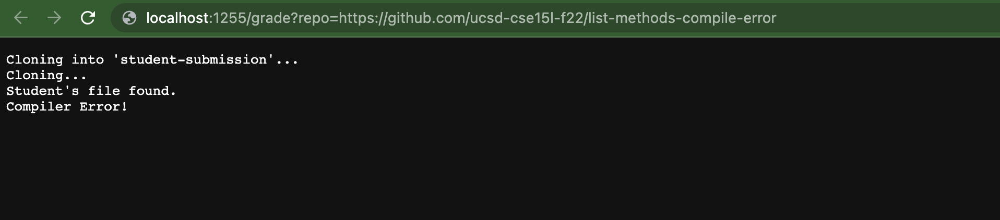
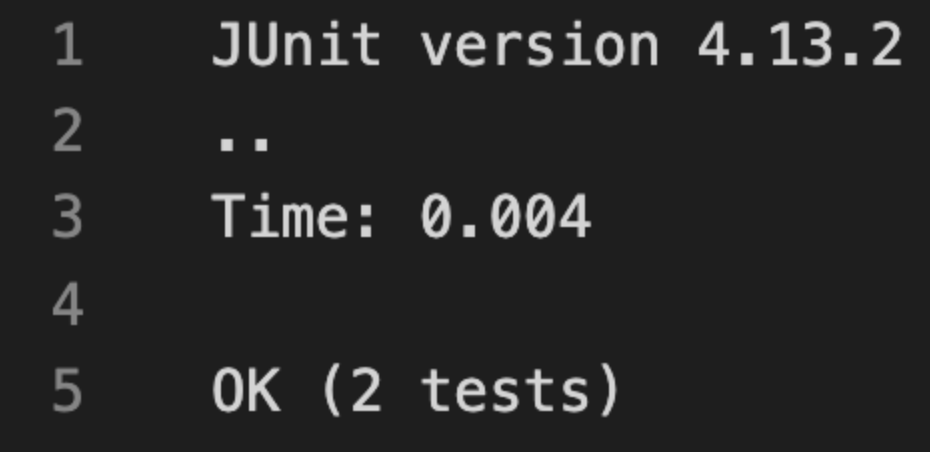

# LAB REPORT 5

### grade.sh

```# Create your grading script here

rm -rf student-submission
git clone $1 student-submission

echo "Cloning..."

cd student-submission

if [ -f ListExamples.java ]
then
    echo "Student's file found."

    echo "Student's file not found."
    exit
fi

cp ListExamples.java ..

cd ..

javac -cp .:lib/hamcrest-core-1.3.jar:lib/junit-4.13.2.jar *.java

if [ $? -ne 0 ]
then
    echo "Compiler Error!"
    exit
fi

java -cp .:lib/hamcrest-core-1.3.jar:lib/junit-4.13.2.jar org.junit.runner.JUnitCore TestListExamples
OK=$(grep -c OK grade.txt)

if [ $OK -eq 1 ]
then
    echo "Pass"
else
    echo "Fail"
fi

exit
```

- Worked with Adarsh Patel












### Trace *FilenameNotFound* 

|   Line   |            Command used            |       Standard Output     |   Return Code   |
| -------- |   :-----------------------------:  |     :-----------------:   |   :----------   |
|    3     |     `rm -rf student-submission`    |              N/A          |         0       |
|    4     | `git clone $1 student-submission`  |              N/A          |         0       |
|    6     |        `echo "Cloning..."`         |         `Cloning...`      |         0       |
|    8     |      `cd student-submission`       |              N/A          |         0       |
|    10    |    `if [ -f ListExamples.java ]`   |              N/A          |         0       |
|    11    |            `then`                  |              N/A          |         0       |
|    14    | `echo "Student's file not found."` |`Student's file not found.`|         0       |
|    15    |            `exit`                  |              N/A          |         1       |

- On Line 10 the if statement was false because there was not a file named ListExamples.java found in the directory which means that it skipped line 12, echoed line 14 and after exited. This means that the program stopped running after and printed out line 4, line 6, and line 14. Lines 24, and 33 do not run because of an early exit and after running `javac GradeServer.java Server.java` and `java GradeServer 1255` you get the outputs of lines 4, 6, and 14.

